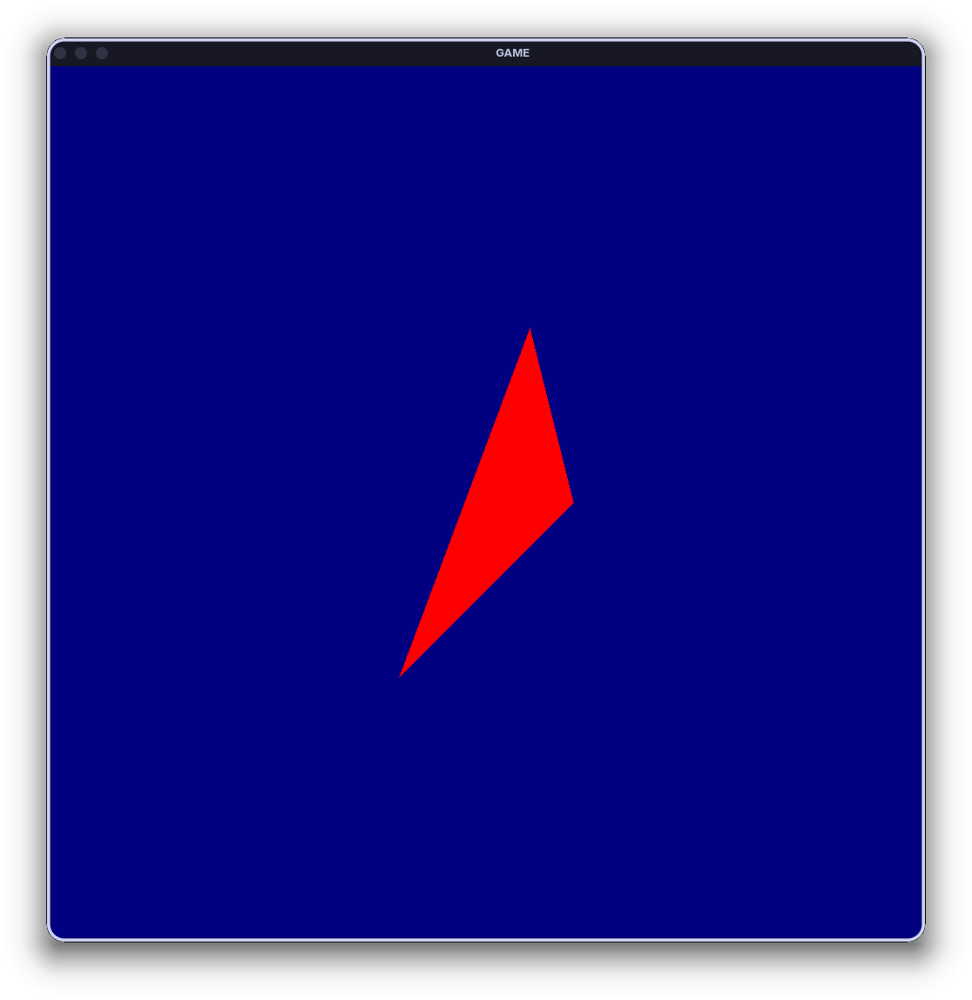
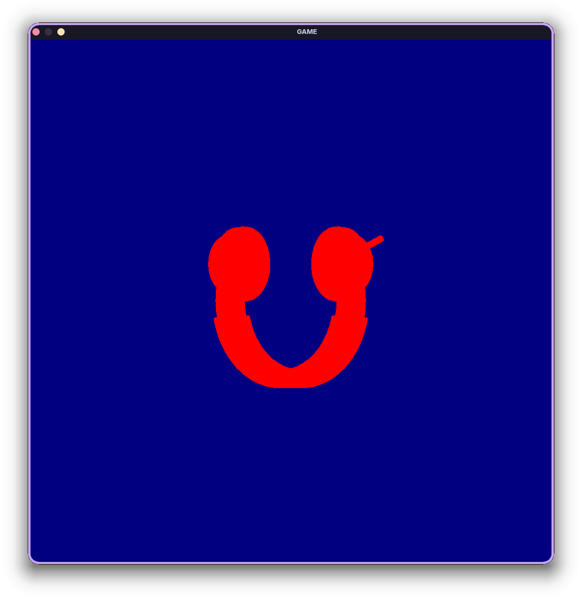
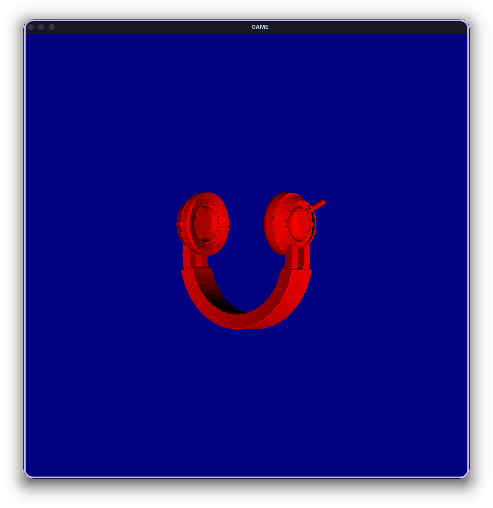
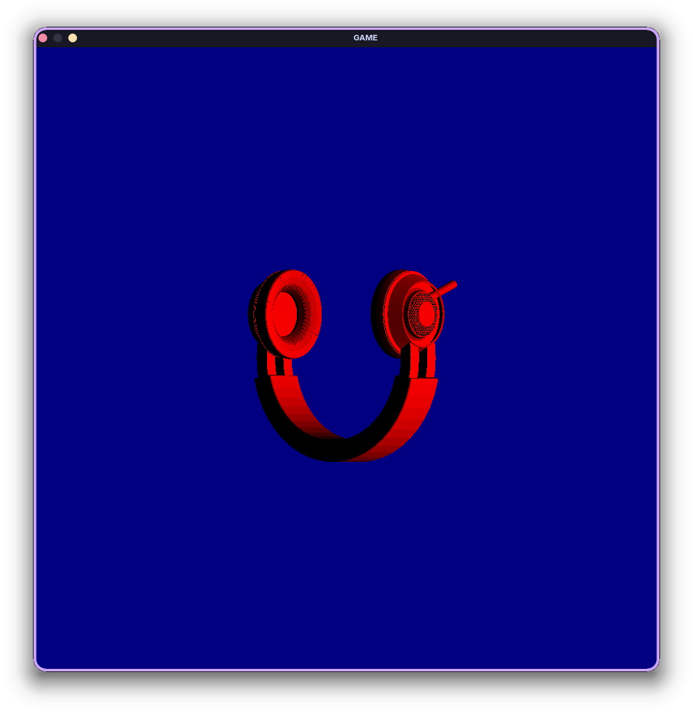

# Advanced Mathematics for Computer Graphics Resubmission

## Task A



This image shows the program working. I have chosen to represent drawn pixels with red and un-drawn pixels with blue to maintain visibility.
The code is fairly simple, it takes an array of triangle structures (currently just 1). Each pixel is then iterated over, with each triangle being tested to see if a straight vector (0, 0, -1) from the pixel location collides with the triangle. If there was a collision, the pixel is set to red. Otherwise, it is set to blue.

As each collision is tested, the distance from the collision point to the pixel is calculated. After all trangles have been tested, the shortest distance collision is then output to the screen. This is how overlaps are handled.

To assist with debugging. All pixels are by default set to green. This ensures that all pixel colours are set during rendering.
The camera is set to be orthographic, to remove possible issues with perspective projection

## Task B

```shell
Triangle Loaded: (12.943610, 8.954204, 60.806538), (14.183111, 7.621198, 59.313065), (14.106984, 6.146854, 59.406326)
Triangle Loaded: (12.005390, 8.228328, 61.948349), (12.943610, 8.954204, 60.806538), (14.106984, 6.146854, 59.406326)
Triangle Loaded: (12.005390, 8.228328, 61.948349), (14.106984, 6.146854, 59.406326), (13.371529, 5.121101, 60.294296)
Triangle Loaded: (12.123429, 5.617157, 61.805557), (12.005390, 8.228328, 61.948349), (13.371529, 5.121101, 60.294296)
Triangle Loaded: (12.732251, 5.108494, 61.069881), (12.123429, 5.617157, 61.805557), (13.371529, 5.121101, 60.294296)
Triangle Loaded: (10.448121, 4.762626, 62.480125), (10.052475, 6.361823, 62.968681), (10.480156, 4.897933, 62.475906)
Triangle Loaded: (10.867167, 4.083846, 61.973701), (10.448121, 4.762626, 62.480125), (10.480156, 4.897933, 62.475906)
Triangle Loaded: (10.867167, 4.083846, 61.973701), (10.480156, 4.897933, 62.475906), (11.136091, 3.962772, 61.751865)
Triangle Loaded: (11.599545, 3.460325, 61.088627), (10.867167, 4.083846, 61.973701), (11.136091, 3.962772, 61.751865)
Triangle Loaded: (11.599545, 3.460325, 61.088627), (11.136091, 3.962772, 61.751865), (12.071890, 3.408578, 60.526325)
```
This continues on, I have shortened it for the sake of this report

I had chosen to use the C++ standard Library for loading and managing the files. This made it easy to load in the file and read each line as an array of floats which could then be mapped to the vertices of each triangle. 

## Task C



The image appears to have loaded as a headset which is upside down.
Within the test, the object appeared too small relative to the camera, thus to simulate zooming, I shrunk the orthographic viewer to 1/10 of the size by having the nested loop that counts over each pixel, count over each 0.1 of the pixels and rendering that as if it were a full pixel. This meant that the image only needed the center 1/10 of the pixels to be rendered, thus the start and end of the for loop could be changed from `-500 to 500` to `-50 to 50`.

## Task D



The shading model I have chosen to implement is a simple diffuse shader. This works by taking the normal and performing a dot product with the cameras view direction vector. This causes faces that are pointing towards the camera to appear well-lit, while faces which point away are darkened. This simple contrast in colour allows for the discernment of details in an object that are lost in a basic colour system.

The diffuse shader's gradient can be seen most presently on the inside of the headband of the headset. As on the parts nearer the cups, it appears brighter but gets progressively darker as it gets to the middle of the headband, in which the faces are facing up causing a perpendicular normal. The dot product shows how close 2 vectors are to being parallel, thus, a perpendicular dot product would be near to 0, which when multiplied with a colour, would result in black. This is what is visible on the middle of the inside of the headband of the headset.

## Task E



For calculating shadows, I have used a brute force method in which each collission is traced twice, first to the actual object from the camera, and then again from the collision point to the light. If this intersects another triangle, then the function will return false. Otherwise, it returns true. Since booleans are representations of simple 0s and 1s, the boolean can be multiplied with the colour to cancel it entirely if the light could not reach it. This is sufficient to achieve realistic lighting since, within this space, there is only 1 light source.

# Final Result


